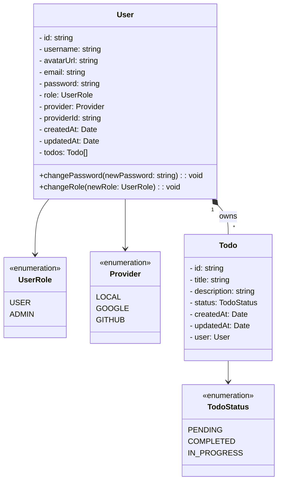

```mermaid
classDiagram

class UserRole {
<<enumeration>>
   USER
   ADMIN
}

class TodoStatus {
<<enumeration>>
   PENDING
   COMPLETED
   IN_PROGRESS
}

class Provider {
<<enumeration>>
   LOCAL
   GOOGLE
   GITHUB
}

class User {
   - id: string
   - username: string
   - avatarUrl: string
   - email: string
   - password: string
   - role: UserRole
   - provider: Provider
   - providerId: string
   - createdAt: Date
   - updatedAt: Date
   - todos: Todo[]
   +changePassword(newPassword: string): void
   +changeRole(newRole: UserRole): void
}

class Todo {
   - id: string
   - title: string
   - description: string
   - status: TodoStatus
   - createdAt: Date
   - updatedAt: Date
   - user: User
}

User  -->  UserRole
User  -->  Provider
Todo  -->  TodoStatus

User "1" *-- "*" Todo : owns
```
